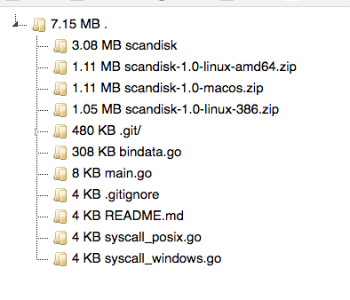

## scandisk

A simple tool to generate html report for disk usage.

Run `./scandisk -root $path`, you will get a html page called `output.html`, which describing the disk usage of `$path`. Open it in your browser, you will see something like this:

Each directory icon could be folded or opened via click.
